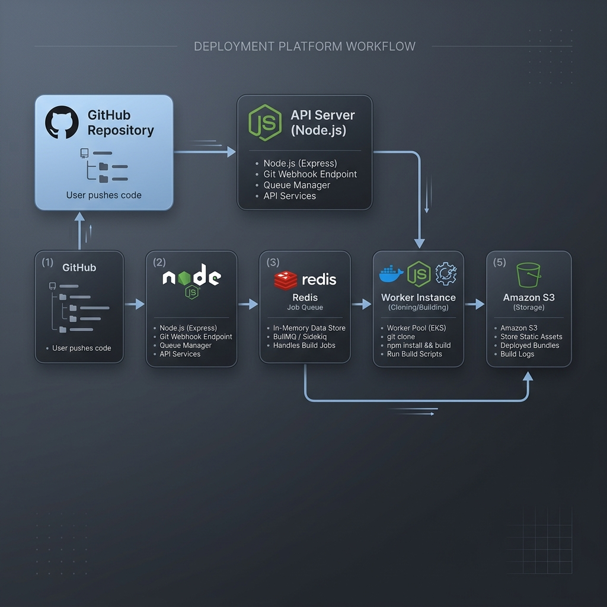

# Launchpad Dashboard 🚀

Launchpad is a high-performance, developer-focused dashboard for managing deployments, similar to Vercel. It provides a "serious" industrial aesthetic designed for data-heavy applications and professional infrastructure monitoring.



## ✨ Features

- **Automated Deployment Flow**: Seamless integration with GitHub repositories.
- **Real-time Status Monitoring**: Live updates on deployment states (Building, Ready, Failed).
- **Industrial Design System**: High-density data displays, mono-spaced technical fonts, and a professional neutral color palette.
- **Responsive Interface**: Optimized for everything from mobile phones up to 1440p+ developer monitors.
- **Log Management**: Deep-black terminal-style log viewer for debugging builds.

## 🛠️ Tech Stack

- **Framework**: [React](https://reactjs.org/) + [Vite](https://vitejs.dev/)
- **Styling**: [Tailwind CSS](https://tailwindcss.com/)
- **UI Components**: [Shadcn UI](https://ui.shadcn.com/)
- **State Management**: [React Hook Form](https://react-hook-form.com/) + [Zod](https://zod.dev/)
- **Routing**: [Wouter](https://github.com/molecula/wouter)

## 🚀 Getting Started

### Prerequisites
- Node.js 20+
- NPM 9+

### Installation
1. Clone the repository
2. Navigate to the directory:
   ```bash
   cd deploy-platform
   ```
3. Install dependencies:
   ```bash
   npm install
   ```
4. Configure environment:
   Create a `.env` file based on `.env.example`:
   ```bash
   VITE_API_URL=http://localhost:8080/api
   ```
5. Run the development server:
   ```bash
   npm run dev
   ```

## 🏗️ Architecture

The frontend communicates with a Node.js API to orchestrate deployments. It uses a custom-built grid system that prioritizes information density and technical clarity.

---

Designed with 🖤 for Developers.
